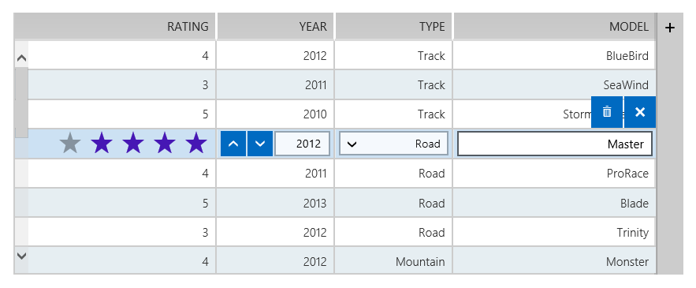

Right-to-Left, or RTL support is a phrase commonly-used to describe the ability of a library, site or application to handle and respond to users who communicate
				with a right-to-left language, like Arabic, Hebrew, Syriac, etc.
			

Starting with Q2 2013, RadControls from Windows 8 HTML provide RTL support and make it extremely easy to enable it.

# Section1Enabling RTL Support for RadControls

Enabling RTL support for all RadControls in a Windows Store app is as simple as setting a single class name. Just set the class name of your page's
					__body__ or __html__ tag to __"k-rtl"__.
				

	
					<body class="k-rtl"></body>
				

Now the direction of the controls and behavior of their features will be reversed.>
						The <legacyBold xmlns="http://ddue.schemas.microsoft.com/authoring/2003/5">k-rtl</legacyBold> class name has to be set to the <legacyBold xmlns="http://ddue.schemas.microsoft.com/authoring/2003/5">body</legacyBold> or the <legacyBold xmlns="http://ddue.schemas.microsoft.com/authoring/2003/5">html</legacyBold> tag and
						not to a container element on the page. This is so because popups used by RadControls, like the dropdown of list controls, the picker part of picker
						controls, etc., are rendered outside of their parent controls and will not pick up the RTL styles applied through the <legacyBold xmlns="http://ddue.schemas.microsoft.com/authoring/2003/5">k-rtl</legacyBold>
						class.
					><legacyBold xmlns="http://ddue.schemas.microsoft.com/authoring/2003/5">Current Limitations</legacyBold>><legacyBold xmlns="http://ddue.schemas.microsoft.com/authoring/2003/5">RadGrid</legacyBold>:Keyboard navigation does not behave correctly in some scenarios.
					><legacyBold xmlns="http://ddue.schemas.microsoft.com/authoring/2003/5">RadChart</legacyBold> and <legacyBold xmlns="http://ddue.schemas.microsoft.com/authoring/2003/5">RadSparkline</legacyBold> do not offer RTL support by default, since they render SVG. You can change
						the charts direction by configuring their axes <legacyBold xmlns="http://ddue.schemas.microsoft.com/authoring/2003/5">reverse</legacyBold> property and fine-tune other settings of the labels, legend, etc.
					

# Related Topics
