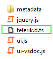
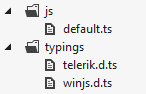
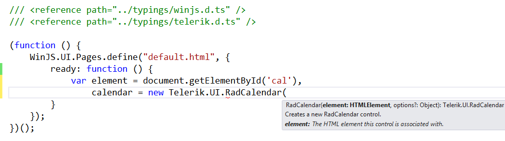
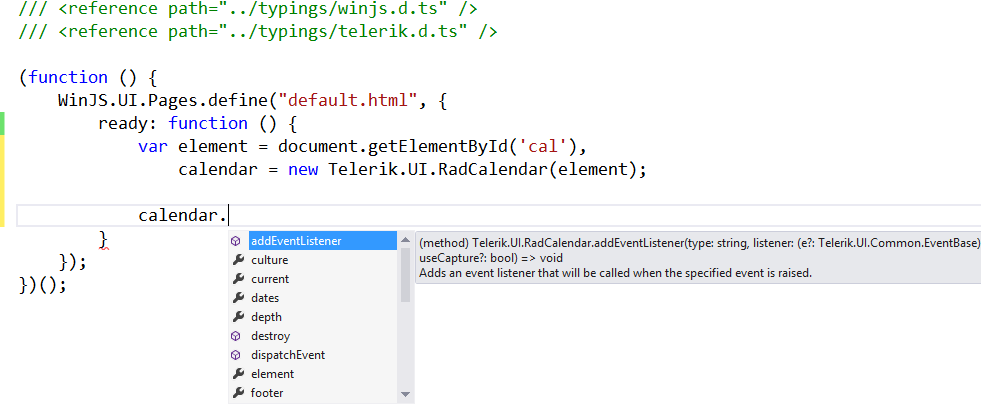
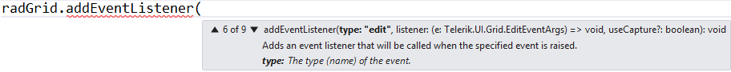

Starting with Q2 2012, RadControls for Windows 8 HTML ship with [TypeScript](http://www.typescriptlang.org/Tutorial/) declarations (with types and documentation) for all RadControls and utility
				types. The following table contains information about which versions of RadControls start 
        supporting a newer version of TypeScript. Note that until the 1.0 version of TypeScript is 
        declared, there can be many breaking changes between versions.
			

RadControls version

TypeScript version

__Q2 2013(2013.2.611)__

__0.8.3.1__

__Q2 2013 SP1(2013.2.716)__

__0.9.0.1__

# Section1How to Use RadControls TypeScript Declarations

You can find the TypeScript declaration of RadControls (__telerik.d.ts__) in:
				

* 

The RadControls for Windows 8 HTML QX 201X installation folder. By default, it is
							*~\Program Files (x86)\Telerik\RadControls for Windows 8 HTML QX 20XX\js*.
						

* 

The *js* folder in the __Dev__, __Hotfix_Dev__ and
							__Source__ downloadable zip archives
						

* 

The *\~Telerik.UI\js* folder of the RadControls for Windows 8 HTML NuGet package.
						

The Telerik namespace is exposed as an internal TypeScript module of the global module and it depends on the WinJS TypeScript declarations. Therefore,
					you need to first get them.
				>
						The WinJS declarations are provided and supported by the TypeScript development team and you can find them in the
						<legacyBold xmlns="http://ddue.schemas.microsoft.com/authoring/2003/5">\bin\winjs.d.ts</legacyBold> file of the current branch of their <externalLink xmlns="http://ddue.schemas.microsoft.com/authoring/2003/5"><linkText>CodePlex repository</linkText><linkUri>https://typescript.codeplex.com/SourceControl/latest</linkUri></externalLink>.
					

In order to use RadControls’ declarations you need copies and references to both the aforementioned files. For example, suppose
					*default.ts* is the file you are working in from the following folder structure:
				

To get it working, add the following two lines of code in the beginning of the file.

	
					/// <reference path="../typings/winjs.d.ts" />
					/// <reference path="../typings/telerik.d.ts" />
				

You now have static typing and API IntelliSense for all RadControls for Windows 8 HTML at development time:

As of __TypeScript 0.9.0.1__ you also have event handler IntelliSense: event handler 
          overloading on constants (the event name), detailed event argument types, etc
        

# Related Topics
