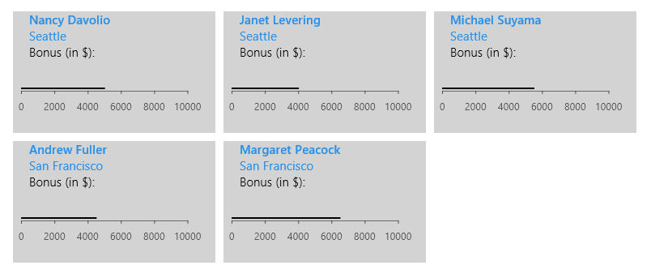
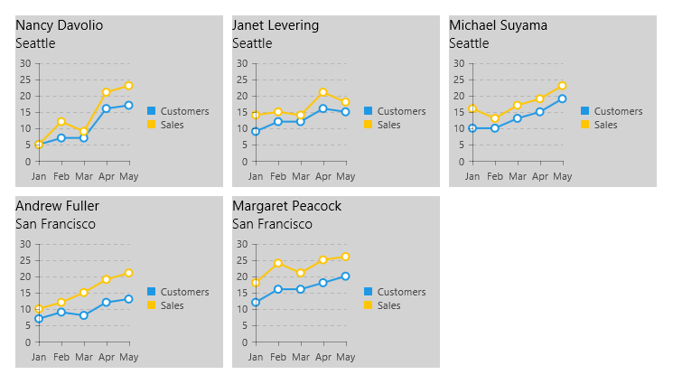

The WinJS library offers native templates that can be used to define a specific layout and content in various scenarios. The
				[WinJS.Binding.Template](http://msdn.microsoft.com/en-us/library/windows/apps/br229723.aspx) provides a reusable binding element which can host pure HTML, controls or even other templates. This help article explains how to
				bind controls from the __RadControls for Windows 8 HTML__ suite inside a __WinJS.Binding.Template__ instance.
				The first part shows which are the supported ways to bind each control's properties and the second part explains each approach.
			

# binding-supportSupported Types of Binding

The following table lists all RadControls and specifies what types of binding inside __WinJS.Binding.Template__ they support. Later in the
					article, you will see examples of achieving each of these bindings.
				

Control Name

Declarative Binding

Custom Binding

Dynamic Creation

Comments

__RadAutoCompleteBox__

Yes

Yes

Yes

You may need to specify width in advance

__RadCalendar__

No

No

Yes

Declarative and custom binding will be fixed in near future

__RadChart__

No, setting properties requires redraw()/refresh()

Yes

Yes

You must not specify width and height in advance when binding dynamically
<!-- This was incorrect edit. -->

__RadComboBox__

Yes

Yes

Yes

You may need to specify width in advance

__RadDatePicker / RadTimePicker__

Yes

Yes

Yes

__RadDropDownList__

Yes

Yes

Yes

You may need to specify width in advance

__RadGauge__

Yes

Yes

Yes

__RadGrid__

Yes, only for properties that do not require refresh()

Yes

Yes

You must specify width and height in advance

__RadHubTile__

Yes

Yes

Yes

__RadNumericBox__

Yes

Yes

Yes

__RadPagination__

Yes

Yes

Yes

__RadSlider__

No

No

Yes

Declarative and custom binding will be fixed in near future

__RadSparkline__

No, setting properties requires redraw()/refresh()

Yes

Yes

You must specify width and height in advance

__RadTokenInput__

Yes

Yes

Yes

You may need to specify width in advance

# default-bindingBinding Control Properties Using Default Binding

When you want to bind the value of a control, or enable/disable a simple feature, you can use the default binding of the
					__WinJS.Binding.Template__. Simply set the __data-win-bind__ attribute of the control's host element to
					*"winControl.[propertyName]: [fieldName]"*, where *propertyName* is the name of the control property
					that you want to bind and *fieldName* is the name of the field from the underlying data source whose value you want to use.
					For example, you have a __WinJS.UI.ListView__ with item template defined that contains a __RadLinearGauge__
					control. You want to bind the __value__ property of the gauge to a field in the ListView data source, called "Bonus". In this
					scenario, the template definition will look as shown in the code snippet below:
				

 __html__
    

			

				

					<h3 data-win-bind="innerText: Name"></h3>
					<h4 data-win-bind="innerText: City"></h4>
					Bonus (in $):
					

					

				

			

			

			

With this definition, you just need to bind the ListView in the code-behind and the gauges will be assigned values.

 __js__
    

				args.setPromise(WinJS.UI.processAll().then(function () {
					WinJS.xhr({
						url: "/js/data.json"
					}).then(function (result) {
						var data = JSON.parse(result.responseText).data;
						listDataSource = new WinJS.Binding.List(data);
	
						listView = document.querySelector("#listView").winControl;
						listView.itemDataSource = listDataSource.dataSource;
					});
				}));

For clarity, here is the structure of an item from the __ListView__ data source.
				

	
					{
						"Name":"Nancy Davolio",
						"City":"Seattle",
						"Stats": [
							{"Month": "Jan", "Sales": 5, "Customers": 5},
							{"Month": "Feb", "Sales": 12, "Customers": 7},
							{"Month": "Mar", "Sales": 9, "Customers": 7},
							{"Month": "Apr", "Sales": 21, "Customers": 16},
							{"Month": "May", "Sales": 23, "Customers": 17}
						],
						"Bonus": 5000
					}
				

Now, you will have a __RadLinearGauge__ with a value set, rendered in each list item.
				Figure 1: Declarative Binding

# custom-bindingBinding Control Properties  Using Custom Binding Initializer

In more complex scenarios, where the entire control needs to be bound or when its nature requires a call to __refresh()__ in order
					to reflect changes in content, custom binding is required. It is achieved using custom binding initializers. If you are not acquainted with the binding
					initializers concept in __WinJS__, you can learn the most important bits from Kraig Brockschmidt's blog:
					[Part1](http://kraigbrockschmidt.com/blog/?p=1004) and
					[Part2](http://kraigbrockschmidt.com/blog/?p=1007).
				

The steps to achieve binding for a RadControl using an initializer are described below.

* 

*Declare the binding in mark-up.* Set the __data-win-bind__ attribute as usual, then add the name
							of the custom initializer after the name of the source property.
						

* 

*Define the initializer in code-behind.* You need to expose it using a namespace, so you can reference it from mark-up.
							The initializer is passed four arguments—__source__, __sourceProperties__, __target__,
							and __targetProperties__. Their meaning is as follows:
						

* 

__source__: The underlying data item.
								

* 

__sourceProperties__: An array of property names that you listed after the colon (:) in the
									__data-win-bind__ attribute value. Usually there will be a single property corresponding to the field name. If you are
									performing binding to nested properties, each sub-property will be a separate entry in the array.
								

* 

__target__: The target element for the binding. When using RadControls, this will be the control element. You can use
									the __winControl__ property to get the actual control instance.
								

* 

__targetProperties__: An array of the property names that you listed before the colon (:) in the
									__data-win-bind__ attribute value. For example, if you bind the __winControl.value__ property of a
									__RadNumericBox__, the __targetProperties__ value will be
									*["winControl", "value"]*.
								

The initializer must contain code that assigns the needed field value to the passed control property. The code to determine the actual target
							property and source value should be specific to the current scenario. You can reuse a custom initializer for multiple bindings as long as the code
							inside the initializer function's body is written to address all possible scenarios.
							For data-bound RadControls, make sure you call __refresh()__ after you assign them their data source. Also, if you are binding
							properties that require control refresh or redraw like, for example, __RadChart's__ series colors, make sure you call the
							appropriate method after setting all values.
						

The following example uses a custom binding initializer to populate a __RadChart__ inside a __ListView__. The
					__ListView__ and its template are defined almost entirely in mark-up. See __Code Listing 3__ below.
				

 __html__
    

			

				

					<h4 data-win-bind="innerText: Name"></h4>
					
					

					

				

			

			

			

The only two pieces of code in the .js file are the binding initializer and the logic that reads the ListView data from an external source. See
					__Code Listing 4__ below for the custom initializer logic and __Code Listing 2__ for the binding logic.
				

 __js__
    

		WinJS.Namespace.define("CustomInitializers", {
			chartBindingInitializer: WinJS.Binding.initializer(function (source, sourceProperty, target, targetProperty) {
				//target is the chart element
				var chart = target.winControl;
				//source holds the current data item, sourceProperty is the property name we specified in data-win-bind
				chart.dataSource.data = source.Stats;
				chart.height = 150;
				chart.width = 230;
				chart.refresh();
			})
		});

__Figure 2__ below shows the result of the described scenario.
				Figure 2: Template Using a Custom Binding Initializer

# dynamic-bindingBinding Controls Properties Dynamically

The scenario from the previous section can also be achieved if you bind the __RadChart__ controls dynamically after the
					template items have been loaded and bound—in this case the __ListView__ items. The steps below are focused on a scenario where the
					__WinJS.Binding.Template__ is part of a __WinJS.UI.ListView__ but the logic would be similar for all other scenarios.
				

* 

*Define the template*. If needed, you can use hidden fields to keep data in the
							__WinJS.BindingTemplate__ that will be needed to later identify the relevant data item in the data source.
							If you use a __ListView__, add one more hidden field which marks whether controls have already been instantiated within each
							item.
						

 __html__
    

			

				

					<h4 data-win-bind="innerText: Name"></h4>
					
					

					

					<input type="hidden" />
				

			

			

			

* 

Use an event where the parent control, e.g. __ListView__, is already loaded and populated. Inside this event, get the
							wrapper elements of all controls that need to be bound or customized. See __Code Listing 6__ and
							__CodeListing 7__.
						

 __js__
    

				args.setPromise(WinJS.UI.processAll().then(function () {
					WinJS.xhr({
						url: "/js/data.json"
					}).then(function (result) {
						var data = JSON.parse(result.responseText).data;
						listDataSource = new WinJS.Binding.List(data);
						BindingSample.employeesData = listDataSource;
	
						listView = document.querySelector("#listView").winControl;
						listView.itemDataSource = BindingSample.employeesData.dataSource;
						listView.addEventListener("loadingstatechanged", processCharts);
					});
				}));

 __js__
    

		function processCharts(e) {
			if (e.target.winControl.loadingState == "complete") {
				var charts = document.querySelectorAll("#salesChart");
				populateCharts(charts);
			}
		}

* 

*Bind the controls in the template*. Based on the available data context, get the corresponding data and bind the
							controls inside the template. If using a __ListView__, change the status of the hidden field to "loaded" to prevent the
							creation of new controls each time the __ListView__ is scrolled. See __Code Listing 8__ below for an
							example.
						

 __js__
    

		function populateCharts(chartElements) {
			var data = BindingSample.employeesData;
			var name;
			var dataItem;
			var chart;
	
			for (var i = 0; i < chartElements.length; i++) {
				//check if the item is marked as loaded; if not, proceed with loading
				if (chartElements[i].nextElementSibling.value != "loaded") {
					name = chartElements[i].parentNode.querySelector("h4").innerText;
					//access the data item using the employee name rendered in the template
					dataItem = getDataItemByName(data, name);
					if (dataItem) {
						chart = chartElements[i].winControl;
						chart.dataSource.data = dataItem.Stats;
						chart.refresh();
						//mark the current item as loaded
						chartElements[i].nextElementSibling.value = "loaded";
					}
				}
			}
		}
	
		//a function that looks for the data item corresponding to the employee name
		function getDataItemByName(data, name) {
			var dataItem;
			data.forEach(function (item, i) {
				if (item.Name == name) {
					dataItem = item;
				}
			});
			return dataItem;
		}

# Related Topics[WinJS.Binding.Template](http://msdn.microsoft.com/en-us/library/windows/apps/br229723.aspx)[WinJS.Binding Initializers, Part 1](http://kraigbrockschmidt.com/blog/?p=1004)[WinJS.Binding Initializers, Part 2](http://kraigbrockschmidt.com/blog/?p=1007)[ListView.onloadingstatechanged event](http://msdn.microsoft.com/en-us/library/windows/apps/hh700709.aspx)
